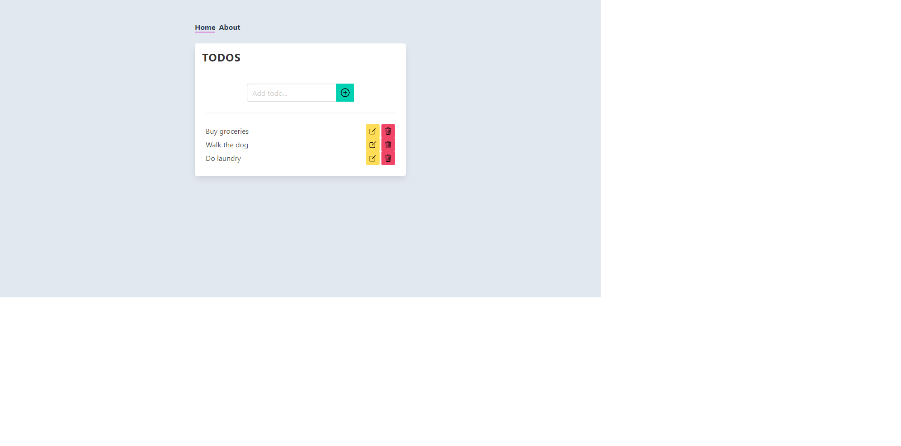

# ANGULAR-CRUD

> A **CRUD** todo app built using [Angular](https://angular.io) framework and [Mirage.js](https://miragejs.com/) mock API.



## Clone repo in an empty directory

## Install:

```
npm install
```

## To run:

```
npm start
```

Opens in the browser on [http://localhost:3000](http://localhost:3000)

## To build:

```
npm run build
```

## To lint:

```
npm run lint
```

## To lint:

```
npm run format
```

&#9888; This project is not finished. It is work in progress **(WIP)!** &#9888;

### Todo
- [ ] Add update functionality
- [ ] Add active class to navbar
